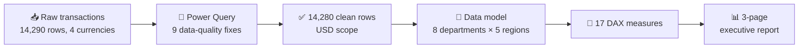

# 📊 FinEdge Solutions — Where Is the Margin Going?


-9%20data%20fixes-742774)


> **⚡ 30-second version**
> - 🎯 **Question:** is this B2B SaaS fintech running a healthy margin, where are budgets breaking, and is the 2024 revenue drop one team's problem or the whole market's?
> - 💰 **Margin:** $911M revenue (USD, FY2022–24) at a **24.5% operating margin**, inside the 20–28% SaaS rule of thumb.
> - 🚨 **Biggest leak:** Marketing overspent its budget by **32%**, the worst of 8 departments.
> - 📉 **The drop:** revenue fell **39% in 2024** across every revenue department at once, which points to the market rather than one team.
> - 🔁 **Cushion:** **50.6%** of revenue is recurring.

> **Data provenance:** simulated dataset. All figures are outcomes of the analysis, not client results.

---

## 📊 Live dashboard

👉 [**Open the interactive Power BI report**](https://app.powerbi.com/view?r=eyJrIjoiOGJjZDlhMjgtYmQzYS00OWRmLWEzYTgtM2FjMjMxYTY2OTkxIiwidCI6Ijk2NmMyMmM4LWY2NTUtNDQ1Ny1iYmM3LTEwMmMwZTgyMDU0OCJ9&embedImagePlaceholder=true) (public, no login)

| Page | What it answers |
|---|---|
| 🧾 Executive Summary | Is the business healthy overall? |
| 📈 Trend & Variance | How did revenue move, and which budgets broke? |
| 👥 Department Deep-Dive | Which teams earn their headcount? |

---

## 🗺️ How the pipeline flows



---

## 📦 Data at a glance

| | |
|---|---|
| 📚 Source | Simulated B2B SaaS fintech transaction data |
| 📆 Period | FY2022 – FY2024 |
| 📏 Rows | 14,290 raw → **14,280** after removing 10 duplicate Transaction IDs |
| 🧱 Grain | One row per financial transaction |
| 🏢 Coverage | 8 departments · 5 regions · 25 sub-categories |
| 💱 Currency | USD analysed; EUR, GBP and AED out of scope (no exchange-rate table) |

---

## 🔍 What the data says

### 1️⃣ 💰 The margin is healthy

| Metric | Result | Rule of thumb |
|---|---|---|
| Total revenue (USD) | **$911M** | — |
| Operating margin | **24.5%** | 20–28% for SaaS ✅ |
| Recurring revenue share | **50.6%** | 40%+ for SaaS ✅ |


### 2️⃣ 📈📉 Boom, then a market-wide drop

- 🚀 **2023:** revenue peaked at **$410M**, up 58% on 2022
- 📉 **2024:** revenue fell **39%**, across every revenue department at the same time

When every revenue team drops together, the cause is usually outside the company. That points to a market correction, not one weak team.

### 3️⃣ 🚨 Where budgets broke

```
Expense vs budget
Marketing         ████████████████  +32%  🔴  largest overrun
Operations        ███████           +14%  🔴
Technology        ████               +8%  🔴
Customer Success  under budget            🟢
Sales             under budget            🟢
```


### 4️⃣ 👥 Which teams earn their headcount

**Sales generates $11.3M revenue per employee**, more than 3× the next of the four revenue-generating departments.


---

## 🧭 The decision

**Do now**

| | Action | Why |
|---|---|---|
| 🚨 | Audit Marketing spend | A 32% overrun in a pure cost centre isn't sustainable into FY2025 |
| 🔍 | Diagnose the 2024 drop | Churn, renewals and pipeline coverage separate cyclical from structural |
| 🧹 | Fix 629 unclassified transactions at source | The gap repeats every reporting cycle until it's fixed upstream |
| 🛠️ | Review Technology costs | Overspend plus falling revenue squeezes margin from both sides |

**Build next**

- 📏 Make Operating Margin and Recurring Revenue % primary KPIs alongside total revenue
- 🔁 Add rolling 12-month revenue tracking
- 📅 Department-level variance dashboards for monthly CFO review
- 💱 An exchange-rate table to bring EUR, GBP and AED into scope

---

## 🧹 Nine data-quality fixes (all in Power Query)

| | Problem found | What I did |
|---|---|---|
| 🏷️ | 107 raw department strings (24 distinct after case/space cleanup) | Mapped to 8 canonical departments via a lookup-table merge |
| 📅 | Mixed date formats (ISO, DD-MM-YYYY, MM-DD-YYYY, DD-Mon-YY, slash) | Parsed with a custom M function |
| 🔢 | 2.5% of Quarter values wrong | Re-derived Quarter from Transaction_Date |
| 🕳️ | 7% of Budget_Amount missing | Flagged, not imputed; excluded from variance calcs only |
| ❓ | 629 blank Category rows (4.4%) | Isolated as "Unclassified": a governance gap, not a cleaning call |
| ↩️ | 140 reversals mixed into revenue | Separated using the Notes audit trail |
| 👯 | 10 duplicate Transaction IDs | Removed (they inflated revenue and expense totals) |
| 💱 | 4 currencies, no exchange-rate table | Scoped to USD rather than guess rates |
| 📏 | Extreme transactions | Flagged above 3 standard deviations, excluded from expense aggregates |

---

## 🧮 The DAX layer — 17 measures

- 💵 **Total Revenue / Total Expenses** with explicit filters: Completed status, USD scope, positive amounts
- 📊 **Gross Profit and Operating Margin %** using safe `DIVIDE`
- ⚖️ **Variance and Variance %**, built from Actual vs Budget (not pre-calculated in the source)
- 👥 **Revenue and Cost per Employee**, linking output to headcount
- 🔁 **Recurring Revenue %**, tracked against the SaaS benchmark

## 🎨 Report design

- 🧭 Three pages with button navigation and a custom JSON theme
- 🎨 **Colour carries meaning, not decoration:** purple for revenue and neutral metrics, coral for expenses and overruns, green for budget increases
- 🎚️ Year and quarter slicers on the Trend & Variance page
- 📊 KPI cards, trend lines, comparison bars, waterfall and ranking charts

---

<details>
<summary>🗂️ <b>Raw data schema</b> (click to expand)</summary>

| Column | Description |
|---|---|
| Transaction_ID | Unique transaction identifier |
| Transaction_Date | Date of transaction (mixed formats, cleaned) |
| Month_Name / Month_Number | Calendar month for trend slicing |
| Fiscal_Year | 2022, 2023, 2024 |
| Quarter | Re-derived from Transaction_Date |
| Department | 107 raw strings → 8 canonical |
| Cost_Center | Department cost centre code |
| Category | Revenue or Expense (629 blank, isolated as Unclassified) |
| Sub_Category | 25 revenue and expense sub-types |
| Region | 5 global regions |
| Currency | USD, EUR, GBP, AED |
| Actual_Amount | Amount in local currency |
| Budget_Amount | Approved budget (7% missing, flagged) |
| Profit_Margin_Pct | Cross-validated against Actual/Budget |
| Is_Recurring_Revenue | Yes/No flag for recurring revenue |
| Contract_Type | Annual, Monthly, One-time |
| Dept_Headcount | Headcount per department per year |
| Transaction_Status | Completed, Pending, Cancelled, Failed |
| Payment_Method | Bank Transfer, Wire, ACH, Credit Card, Online |
| Approved_By | Approving manager (8.3% missing, flagged) |
| Notes | Free-text audit trail for reversals and approvals |

</details>

<details>
<summary>🚧 <b>Limitations</b> (click to expand)</summary>

- **USD only:** EUR, GBP and AED transactions are excluded until an exchange-rate table exists.
- **629 unclassified transactions** can't be allocated to Revenue or Expense without business context.
- **Annual headcount:** intra-year hiring and exits don't show in monthly revenue per employee.
- **No marketing attribution data:** the overrun can be sized, but not its return.
- **2024 drop is not modelled against macro factors**; the market-wide reading is an inference from the pattern.
- **Benchmarks are rules of thumb:** the 20–28% margin and 40% recurring figures aren't sourced to a specific study.

</details>

---

## 🔭 What I'd do next

- 💱 Exchange-rate dimension to bring all currencies into scope
- 🔁 Rolling 12-month revenue and margin trend
- 🔐 Row-level security so each department head sees only their cost centre
- 📉 Churn and renewal data to explain the 2024 decline
- 🔮 H2 reforecast from H1 actuals and variance trends

## 🛠️ Tools

Power BI Desktop · Power Query (M) · DAX · Excel / CSV · GitHub

---

*Part of Rahul Bhagat's Data Analytics Portfolio · [🌐 Portfolio](https://rahulbhagat29.github.io/) · [💼 LinkedIn](https://www.linkedin.com/in/rahulbhagat29) · [🐙 GitHub](https://github.com/rahulbhagat29)*
